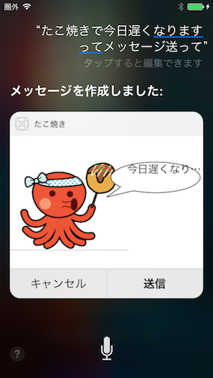

# iOS10 SiriKitを使用したサンプル　〜たこ焼きでメッセージ送って〜

iOS10で使用可能になったSiriKitを使用して、メッセージを送るアプリ「たこ焼き」を作成してみました。

「たこやき」とは、常に決まっている特定の相手にメッセージを送信するアプリです。 メッセージ送信には、「宛先」・「宛先グループ」・「本文」の諸元が有りますが、このうち「本文」以外は常に一定なので、「本文」だけを伝えれば、直ちにメッセージを送信できます。

詳しくは、下記に解説があります。
 [[iOS10] SiriKitでメッセージ送信アプリを作成してみた　〜”たこ焼き”でメッセージ送って！〜](http://dev.classmethod.jp/smartphone/ios-10-sirikit-message-app/)

